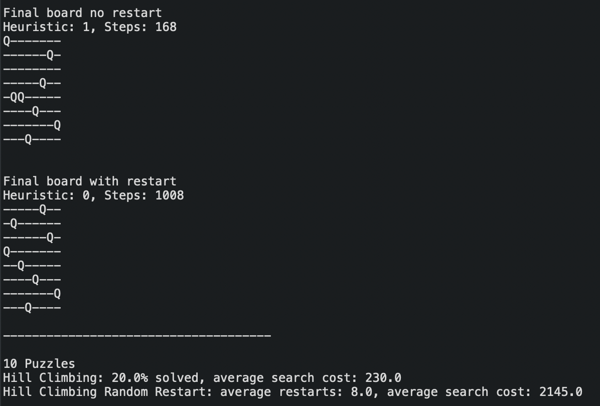

# EightQueens
Author: Max Morhardt

  

This is a program to solve the eight queens problem using a search based A.I. Eight queens is a problem where the goal is to get eight chess queens onto a chess board where none of them can attack each other. Two versions of the Hill Climbing algorithm are used to continuously improve on previous decisions that were made. A JUnit test suite ensures the heuristic is calculated properly.

The program's entry point is in the EightQueen class within the application package.
